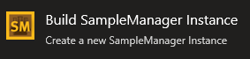
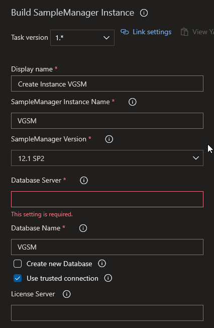
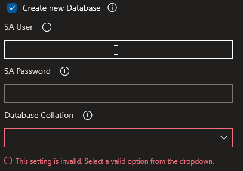
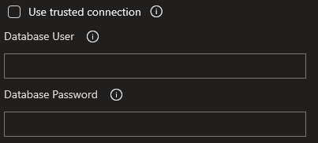
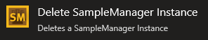
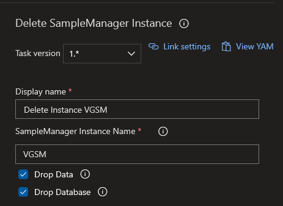

# SampleManager Build Tasks

Repository for creating a Build Task for a propietary Software that need to have an instance created prior to build the Solution

[TOC]

## Create-Instance Task
---

This task an be used to create a new SampleManager Instance.

By enabling the _Create new Database_ option, the task will create a new SQL Server Database.

By disabling the _Use trusted Connection_ option, the task will create Instance by using the gven connection informations for the database.

## Delete-Instance Task
---

This task an be used to create a new SampleManager Instance.

