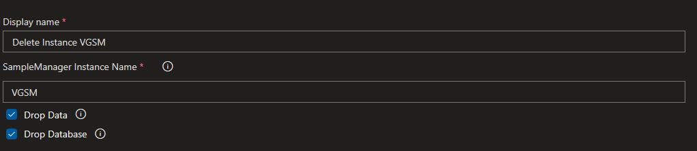

# SampleManager Build Tasks

Repository for creating a Build Task for a propietary Software that need to have an instance created prior to build the Solution

[TOC]

## Create-Instance Task

## Delete-Instance Task
---
